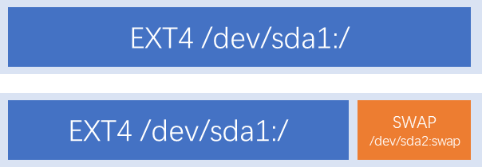
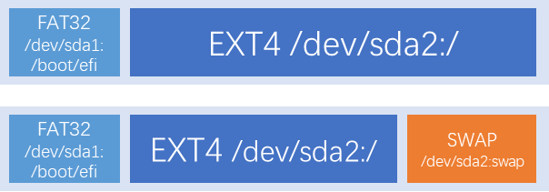
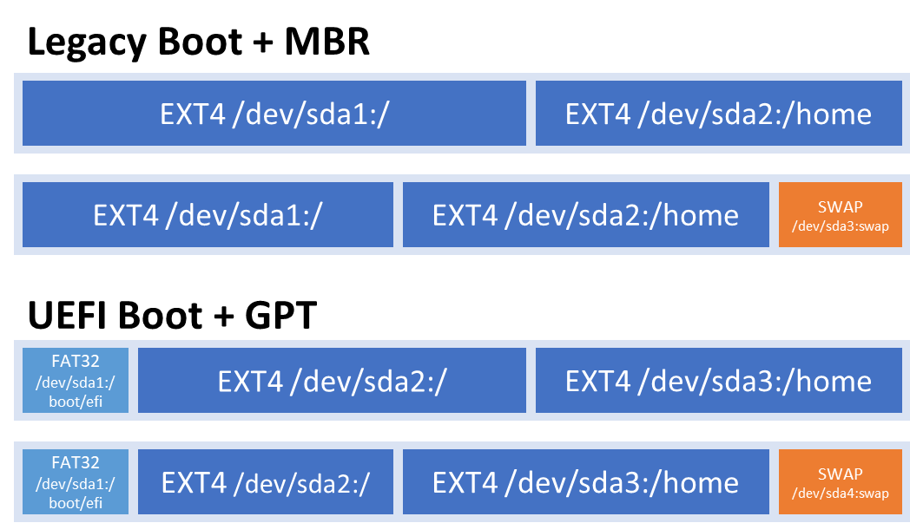

家有一台 MSI U100 上网本，英特尔凌动（Atom）N270 CPU，预装 Windows XP，后安装 LEDE，现在闲置。打算安装Arch Linux，再安装 V2RayA 等，兼作学习 Linux 用。

这台上网本是 Legacy Boot 引导，32位CPU，有有线网口。

# 准备工作

## 准备安装映像

在 https://archlinux.org/download/ 下载 64 位安装映像。

在 https://archlinux32.org/download/ 下载 32 位安装映像。

在 64 位下载页面的底部有各地镜像网站列表，中国也有镜像网站，但只有 64 位镜像。



Arch Linux 官方已停止对 32 位设备的支持。现在的 32 位 Arch Linux 是社区开发的。



找到 BitTorrent Download (recommended) ，点击 Magnet Link for 2024.07.10 (i686 only) 通过磁力链接下载（版本号可能不同，下同），点击 Torrent for 2024.07.10 (i686 only) 通过种子下载。

使用 balenaEtcher 或 `dd` 等工具将映像刻录到 U 盘上。

# 安装

## 安装前准备

### 连接到网络

Arch Linux 的安装过程需要联网。

#### 有线网络

Arch Linux 会自动连接到有线网络，无需配置。

#### 无线网络

使用 `iwctl` 进行连接：

```shell
iwctl # 进入交互式命令行
device list # 列出无线网卡设备名，比如无线网卡看到叫 wlan0
station wlan0 scan # 扫描网络
station wlan0 get-networks # 列出所有 wifi 网络
station wlan0 connect wifi-name # 进行连接，注意这里无法输入中文。回车后输入密码即可
exit # 连接成功后退出
```



若无线网卡无法显示，请参考：

https://wiki.archlinuxcn.org/wiki/网络配置/无线网络配置



#### 检验是否已连接

```sh
ip a
```

如果有显示，说明已经通过 DHCP 获取到 ip 地址。

---

测试是否已联网：

```sh
ping cn.bing.com
```



`Ctrl + C` 停止 Ping。



### 设置时间

```sh
timedatectl set-timezone Asia/Shanghai  # 设置时区为亚洲/上海（UTC+8）
timedatectl status  # 显示时间状态
timedatectl set-ntp true  # 设置时间同步
```

## 分区

### 查看硬盘

```sh
lsblk
```



这里我们要安装到的硬盘是 `/dev/sda`，一定要看清楚你的盘到底是哪块，请勿无脑复制粘贴，小心格式错盘造成数据丢失。下面提到的 `/dev/sda` 即指这块硬盘，命令中出现 `/dev/sda` 也要替换成相应硬盘。



### 建立分区

#### Legacy Boot + MBR



1. 一个 EXT4（也可使用 btrfs）格式的主分区，挂载到根目录，存放系统、软件包和引导文件
2. 一个 Swap 格式的交换分区（可选），即虚拟内存，大小一般 <= 电脑内存，这里是以分区形式使用，可用交换文件 swapfile 替代

#### UEFI + GPT



1. 一个 FAT32 格式的 ESP 分区，大小约 500 MB，挂载到 `/boot/efi`
2. 其余同 Legacy Boot + MBR

#### home 分区

推荐额外建立 home 分区挂载到 `/home`，大小略大于根目录分区，存放个人文件，这样系统滚挂后个人文件不会丢。



如图，在原来 EXT4 格式的根目录之后，再建立一个 EXT4 格式的 home 分区。

---

建议使用 `cfdisk` 伪图形界面进行分区：

```sh
cfdisk dev/sda
```

也可使用 `fdisk` ：

```sh
fdisk dev/sda
```

`m` 键查看帮助。

### 格式化

创建好分区后，还需要格式化分区以创建文件系统

`lsblk` 查看硬盘分区。

这里我们的安装分区是 `/dev/sda1`，使用交换文件，请勿无脑复制粘贴。

#### Legacy Boot + MBR

1. 把 `/dev/sda1` 格式化成 EXT4：

```sh
mkfs.ext4 /dev/sda1
```



如果要使用 btrfs，而非 ext4，把 `/dev/sda1` 格式化成 btrfs：

```sh
mkfs.btrfs /dev/sda1
```





如果要使用交换分区，而非交换文件，还需把 `/dev/sda2` 格式化成 SWAP：

```sh
mkswap /dev/sda2
```



#### UEFI + GPT

1. 把 `/dev/sda1` 格式化成 FAT32：

```sh
mkfs.fat -F32 /dev/sda1
```

2. 把 `/dev/sda2` 格式化成 EXT4：

```sh
mkfs.ext4 /dev/sda2
```



如果要使用 btrfs，而非 ext4，把 `/dev/sda1` 格式化成 btrfs：

```sh
mkfs.btrfs /dev/sda1
```





如果要使用交换分区，而非交换文件，还需把 `/dev/sda2` 格式化成 SWAP：

```sh
mkswap /dev/sda2
```



上面给出的请勿无脑复制，需要对应上面图片的分区表按需调整



`dev/sda1` 表示硬盘 `dev/sda` 上的第1个分区，`dev/sda2` 表示第2个分区，以此类推。



### 挂载分区

待会儿安装程序 pacstrap 会将系统文件安装到 `/mnt` 目录，因此我们需要挂载要存放系统文件的分区到 `/mnt` 目录：

```sh
mount /dev/sda1 /mnt
```

如果刚才没有建立交换分区，使用交换文件，执行下面的命令创建一个 2048MB 的 swapfile 到刚刚挂载的 `/mnt`：

```sh
dd if=/dev/zero of=/mnt/swapfile bs=1M count=2048 status=progress
chmod 0600 /mnt/swapfile
mkswap -U clear /mnt/swapfile
swapon /mnt/swapfile
echo /mnt/swapfile none swap defaults 0 0 >> /etc/fstab
```

如果建立了 home 分区，还需：

```sh
mkdir /mnt/home
mount /dev/sda2 /mnt/home
```

## 安装系统

### 换源



如果不换源，国内部分会慢得要死。但是我的设备是 32 位的，而国内没有 32 位源。

TUNA 镜像的 Github 仓库已有人提 Issue 要求添加 32 位镜像 https://github.com/tuna/issues/issues/926 。



在特定情况下，reflector 会误删某些有用的源信息，这里进入安装环境后的第一件事就是将其禁用：

```sh
systemctl stop reflector.service
```

#### 64 位：

如果是 64 位的 Arch Linux，可以执行下列命令添加国内镜像源：

##### 方式 1：

编辑 `/etc/pacman.d/mirrorlist`：

```sh
vim /etc/pacman.d/mirrorlist
```

在文件的最顶端添加：

```ini
Server = https://mirrors.ustc.edu.cn/archlinux/$repo/os/$arch
Server = https://mirrors.tuna.tsinghua.edu.cn/archlinux/$repo/os/$arch
Server = https://repo.huaweicloud.com/archlinux/$repo/os/$arch
Server = http://mirror.lzu.edu.cn/archlinux/$repo/os/$arch
```

##### 方式2：

```sh
pacman-mirrors -i -c China -m rank
```

执行后会弹出一个对话框，可以选择镜像源。

#### 32 位：

国内暂时没有 32 位的镜像源。可以使用系统自带的德国、波兰、瑞士等地的镜像源代替，无需配置。

### 装必需包

先初始化pacman密钥：

```sh
pacman-key --init
```

安装 `base` 软件包和 Linux 内核以及常规硬件的固件（相比官方教程，增加了 `base-devel`）

最新内核（会滚挂）：

```sh
pacstrap -K /mnt base linux linux-firmware base-devel
```

LTS 稳定内核（推荐）：

```sh
pacstrap -K /mnt base linux-lts linux-firmware base-devel
```

注意：

1. 可以将 `linux` 替换为其他内核软件包：
   - `linux`：原版的 Linux 内核和模块，采用了一些补丁
   - `linux-lts`：受长期支持的 Linux 内核和模块
   - 参考：https://wiki.archlinuxcn.org/wiki/%E5%86%85%E6%A0%B8
2. `linux-zen` 内核不支持英伟达显卡
3. 希望稳定使用，就选 `linux-lts` 内核
4. 安装后仍然可以更换内核
5. 在虚拟机或容器中安装时，可以不安装固件软件包 `linux-firmware`

## 配置

### 生成 fstab

生成分区自动挂载 fstab 文件

```sh
genfstab -U /mnt >> /mnt/etc/fstab
```

1. 用 `-U` 或 `-L` 选项设置 UUID 或卷标
2. 刚才的虚拟内存文件会自动转换目录，即由 `/mnt/swapfile` 变为 `/swapfile`
3. 如需查看或更改更多挂载信息，如挂载 ntfs 分区，可以 `vim /mnt/etc/fstab`

### change root

改变根目录 chroot 到新安装的系统

```sh
arch-chroot /mnt
```

1. 不能用 `chroot`
2. 此时，原来安装盘下的 `/mnt` 目录就变成了新系统的 `/` 目录

## 重启前的其他工作

至此，系统已经安装完毕，磁盘分区也已配置好。但我们还需安装一些常用的软件包，设置一些基本信息，并配置启动引导，使系统能被正确地启动。

### 装常用包



有时安装映像包含损坏的密钥，这时需要先安装正确的密钥：

```sh
pacman -S archlinux-keyring archlinux32-keyring
pacman-key --init
pacman-key populate archlinux archlinux32
pacman-key --refresh
```



```sh
pacman -S vim networkmanager dhcpcd iwd sudo bluez usbmuxd ttf-dejavu wqy-zenhei noto-fonts-emoji ntfs-3g sof-firmware
```

- `vim`：文本编辑器，可换为 `nano`，更适合新手
- `networkmanager`：联网用，网络管理组件
- `dhcpcd`：联网用，DHCP 动态获取 IP 地址需要
- `iwd`：作为 `networkmanager` 的 `backend` 进行使用，连 WiFi 需要
- `sudo`：非 `root` 用户暂时获取 `root` 权限需要
- `bluez`：蓝牙模块需要
- `usbmuxd`：usb 连接手机共享网络需要
- `ttf-dejavu`：开源字体
- `wqy-zenhei`：中文字体，显示中文需要
- `noto-fonts-emoji`：emoji 字体，显示表情包需要
- `ntfs-3g`：挂载 ntfs 磁盘需要
- `sof-firmware`：声卡支持

用软链接让 `vim` 替代 `vi`：

```sh
ln -s /bin/vim /bin/vi
```

### 改时区

设置时区为中国上海

```sh
ln -sf /usr/share/zoneinfo/Asia/Shanghai /etc/localtime
```

使用如下命令，生成 `/etc/adjtime`，将系统时间 (UTC) 同步到硬件时间：

```sh
hwclock --systohc
```

### 改地区

如果不安装图形界面，不推荐设置中文，否则会无法显示文字

推荐设置为 `en_GB.UTF-8`

编辑 `/etc/locale.gen`，去掉 `en_US.UTF-8 UTF-8` 以及 `zh_CN.UTF-8 UTF-8` 行前的注释符号（`#`）

或：

```sh
echo en_US.UTF-8 UTF-8 > /etc/locale.gen
echo en_GB.UTF-8 UTF-8 >> /etc/locale.gen
echo zh_CN.UTF-8 UTF-8 >> /etc/locale.gen
locale-gen
echo LANG=en_GB.UTF-8 > /etc/locale.conf
```

- 不推荐在此设置任何中文 `locale`，会导致 `tty` 乱码
- 中文的问题，一般会通过修改 `~/.xprofile`（DE） 或者 `~/.xinitrc`（WM） 进行解决

### 改主机名

修改主机名（设备名称）为 `archlinux`，可自行更换

```sh
echo archlinux > /etc/hostname
```

---

添加 `hosts` 信息

```sh
echo -e "127.0.0.1\tlocalhost\n::1\tlocalhost\n127.0.0.1\tarchlinux.localdomain archlinux" >> /etc/hosts
```

### 设置密码

为 `root` 用户设置密码

```sh
passwd
```

### 配置启动引导

安装软件包：

```sh
pacman -S grub efibootmgr
```

其中：

- `grub` 是启动引导器
- `efibootmgr` 用于写入启动项



再安装 `os-prober` 用于检测和引导 Windows 10：

```sh
pacman -S os-prober
```



安装 `grub` 到硬盘（不是分区）：

```sh
grub-install /dev/sda
```

修改 `/etc/default/grub` 中的 `GRUB_CMDLINE_LINUX_DEFAULT` 一行，在等号后加入 `nowatchdog` 参数可以显著提高开关机速度。



在该文件末尾添加：

```
GRUB_DISABLE_OS_PROBER=false
```

启用 `os-prober`。



最后，生成 `grub` 配置文件：

```sh
grub-mkconfig -o /boot/grub/grub.cfg
```

退出重启：

```sh
exit
umount -R /mnt
reboot
```

## 重启后的一些工作

重启后输入用户名 `root`，然后输入管理员密码。

### 联网

```sh
systemctl enable --now NetworkManager
```

启用网络相关服务：

```sh
systemctl start iwd
systemctl enable iwd
systemctl start systemd-resolved
systemctl enable systemd-resolved
systemctl enable bluetooth
systemctl enable NetworkManager
systemctl enable dhcpcd
```

设置 `iwd`：

```sh
echo -e "[General]\nEnableNetworkConfiguration=true\nNameResolvingService=systemd" > /etc/iwd/main.conf
echo -e "[device]\nwifi.backend=iwd" >> /etc/iwd/main.conf
```

重启后生效（有线网络立即生效，无需重启）：

```
reboot
```

# 使用 SSH 连接

我的 MSI U100 打字不大方便，打算此后通过 SSH 远程连接操作。。

```sh
pacman -S openssh
systemctl start sshd.service
systemctl enable sshd.service
```

使用 `ip a` 查看设备 IP 地址。

使用 `putty` 或 `ssh` 等工具连接到设备。

连接后，若希望关闭屏幕省电：

```sh
setterm --blank force --term linux < /dev/tty1
```



使用这种方法关闭屏幕，按键盘、动鼠标都无法唤醒。只能通过下面命令唤醒。



打开屏幕：

```sh
setterm --blank poke --term linux < /dev/tty1
```

# 参考

https://www.xrgzs.top/posts/arch-linux-install
